# 不会写代码，也能用好 GitHub：写给普通人的入门指南


> "GitHub 不就是程序员用来存代码的地方吗？跟我有什么关系？"

我第一次听到 GitHub 这个名字，也是这么想的。

但后来我发现，**GitHub 早就不只是程序员的地盘了。** 设计师在上面分享素材，作家在上面协作写作，研究者在上面发布数据集，甚至有人把自己的人生目标清单也放在上面管理。

如果你曾经：

- 想下载一个免费的开源工具，却不知道从哪里找
- 想了解某个热门 AI 项目到底是什么
- 想参与一个你感兴趣的项目，却不知道怎么开口

那这篇文章就是写给你的。我会用**不假设你有任何技术背景**的方式，带你把 GitHub 从一个陌生词汇，变成你真正用得上的工具。

---

## 目录

- [一、GitHub 到底是什么？](#一github-到底是什么用一个比喻说清楚)
- [二、注册账号：5 分钟搞定](#二注册账号5-分钟搞定)
- [三、你最常用到 GitHub 的场景](#三你最常用到-github-的场景)
  - [场景一：下载别人的项目或文件](#场景一下载别人的项目或文件)
  - [场景二：搜索你感兴趣的项目](#场景二搜索你感兴趣的项目)
  - [场景三：读懂一个项目页面](#场景三读懂一个项目页面)
  - [场景四：给自己创建一个仓库](#场景四给自己创建一个仓库)
- [四、Markdown：不会代码也能用的排版语言](#四markdown不会代码也能用的排版语言)
- [五、README 里那些"看不懂的命令"是什么意思？](#五readme-里那些看不懂的命令是什么意思)
  - [先理解一件事：有些软件需要"运行环境"](#先理解一件事有些软件需要运行环境)
  - [📝 VS Code](#-vs-code打开和编辑项目文件的标配工具)
  - [🐍 Python 和 pip](#-python-和-pip)
  - [🟢 Node.js 和 npm](#-nodejs-和-npm)
  - [☕ Java 和相关工具](#-java-和相关工具)
  - [🦀 其他你可能遇到的](#-其他你可能遇到的)
  - [速查表：看到什么命令，需要装什么](#一张速查表看到什么命令需要装什么)
  - [关于"虚拟环境"](#关于虚拟环境为什么-readme-总让你先建一个)
- [八、几个常见误解，帮你扫清障碍](#八几个常见误解帮你扫清障碍)
- [九、从今天开始，你可以做的三件事](#九从今天开始你可以做的三件事)
- [总结](#总结)
- [延伸阅读](#延伸阅读)

---

## 一、GitHub 到底是什么？用一个比喻说清楚

想象这样一个场景：

你和几个朋友合写一本书。你们不在同一个城市，每个人负责不同的章节。你们用 Word 写好，通过微信发给彼此，然后……

- "哎，我刚才改的那个版本你覆盖掉了！"
- "等等，这是第几稿了？是 `书稿_最终版_真的最终_v3_改.docx` 吗？"
- "我发的那个有问题，先别用，我再发一版！"

这种噩梦，你一定不陌生。


**GitHub 解决的，就是这个问题。**

它的核心是一套叫 **Git** 的"版本控制系统"——简单说，就是**帮你记录文件每一次修改的历史**，谁在什么时候改了什么，都清清楚楚。而 GitHub，就是在这套系统上搭建的一个**在线平台**，让全世界的人都能协作、分享、讨论。

你可以把 GitHub 理解成：

| 你熟悉的东西 | GitHub 里对应的概念 |
|------------|------------------|
| 文件夹 | 仓库（Repository / Repo） |
| 保存文件 | 提交（Commit） |
| 另存为新版本 | 分支（Branch） |
| 把修改合并进来 | 合并（Merge） |
| 复制别人的文件夹 | Fork |
| 在文档里留评论 | Issue / Pull Request |

不需要死记这些词，对于非程序员仅使用软件而已，如果后面用到的时候慢慢查即可。

---

## 二、注册账号：5 分钟搞定

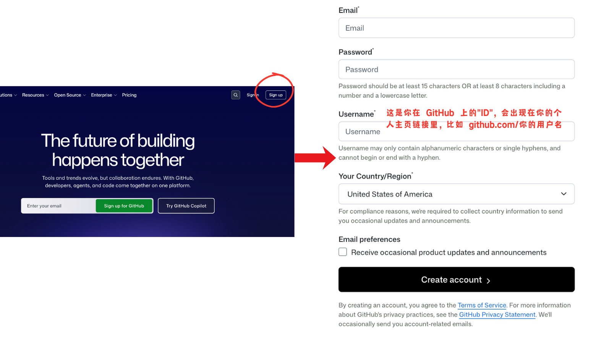

打开 [github.com](https://github.com)，点右上角的 **Sign up（注册）**。

填写：
1. **邮箱地址**（用你常用的）
2. **密码**
3. **用户名**（这是你在 GitHub 上的"ID"，会出现在你的个人主页链接里，比如 `github.com/你的用户名`，认真想一个）

然后验证邮箱，就完成了。**完全免费。**

> 💡 **小提示**：GitHub 的界面是英文的，但不要怕。大多数操作按钮都很直观，而且 Chrome 浏览器自带翻译功能，右键页面选"翻译成中文"就能将就用。

---

## 三、你最常用到 GitHub 的场景

### 场景一：下载别人的项目或文件

这是普通人最常用到 GitHub 的方式。比如你在网上看到一篇文章，说"源码在 GitHub 上"，你该怎么办？

**方法一：直接下载 ZIP 压缩包**

进入一个项目页面（也叫"仓库页面"），找到绿色的 **`< > Code`** 按钮，点开，选 **`Download ZIP`**，就像下载普通文件一样，下载到本地解压就行。

不需要安装任何东西，不需要懂命令行。

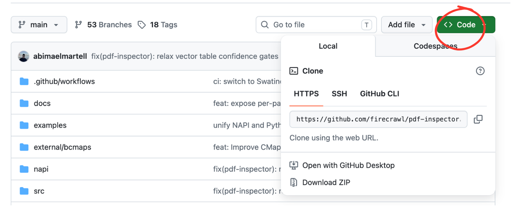

**方法二：用 `git clone` 克隆整个仓库（推荐用于需要"跑起来"的项目）**

如果你打算实际运行一个项目（而不只是看看代码），`git clone` 是比下载 ZIP 更好的方式。它会把整个仓库完整地"复制"到你的电脑上，包括完整的版本历史，而且后续如果项目更新了，你只需要一条命令就能同步最新内容，不用重新下载整个压缩包。

**第一步：安装 Git**

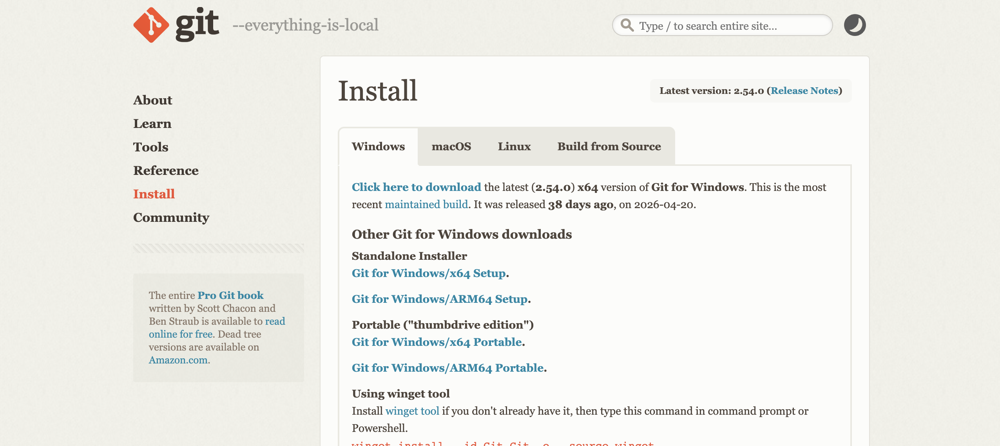

`git clone` 命令需要先安装 **Git**。

- **Windows**：去 [git-scm.com](https://git-scm.com/download/win) 下载安装，一路默认选项即可
- **Mac**：打开终端，输入 `git --version`，如果没装过，系统会自动弹出安装提示，按提示装就行
- **验证是否安装成功**：终端里输入 `git --version`，输出版本号即代表成功

**第二步：找到仓库的克隆地址**

进入 GitHub 仓库页面，点绿色的 **`< > Code`** 按钮，切换到 **HTTPS** 标签，复制那个以 `https://github.com/` 开头的链接。

**第三步：在终端里执行克隆命令**

打开终端，先用 `cd` 命令切换到你想存放项目的文件夹，再执行：

```bash
git clone 刚才复制的链接
```

举个例子：

```bash
cd Desktop
git clone https://github.com/某用户/某项目.git
```

回车之后，Git 会开始下载，你会看到进度信息。下载完成后，桌面上就多了一个以项目名命名的文件夹，里面就是完整的项目。

**后续如果项目更新，只需要进入项目文件夹，执行：**

```bash
cd 项目文件夹名
git pull
```

它会自动把最新的改动同步下来，比重新下载 ZIP 方便多了。

> 💡 **ZIP 下载 vs git clone，该用哪个？**
>
> 如果你只是想**看看代码或者拿几个文件**，ZIP 更简单直接。如果你打算**实际运行这个项目、或者长期跟进更新**，`git clone` 是更好的选择——尤其是后面要执行 `npm install` 或 `pip install` 这类命令的情况，都是默认你已经 clone 下来了。

---

### 场景二：搜索你感兴趣的项目

GitHub 的搜索框在页面左上角，就像用百度或者 Google 一样直接搜关键词。

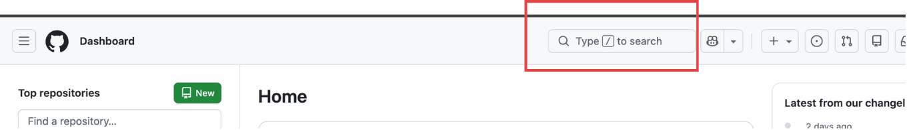

但有几个小技巧，能让搜索结果好很多：

- 搜 **`awesome + 关键词`**：这是 GitHub 上最值得养成的搜索习惯之一，下面单独说
- 按 **Stars（⭐）排序**：Stars 是别人给项目点的"收藏"，数量越多说明越受欢迎，可以作为参考
- 用 **语言筛选**：如果你知道自己想要 Python 或者 JavaScript 的项目，可以在左侧筛选

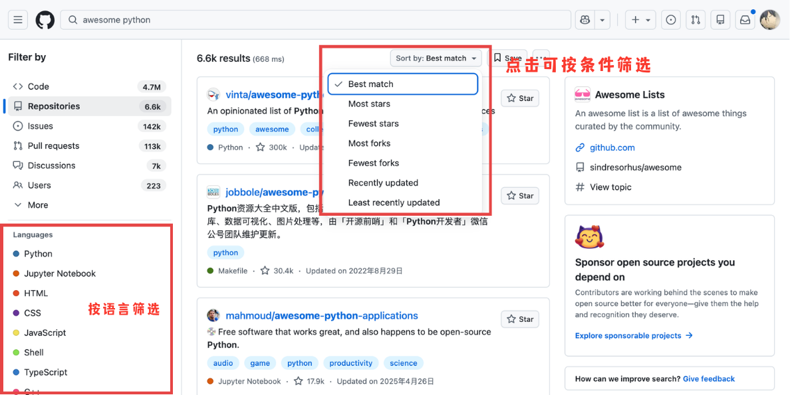

> ⭐ GitHub 上的 Star，就像微博的收藏或者抖音的点赞，是衡量一个项目受欢迎程度的重要指标。

---

**📌 重点说说：awesome 系列是什么**

如果你只学一个 GitHub 搜索技巧，那就学这个。

"awesome"是 GitHub 上一种约定俗成的命名规范——当有人整理了某个领域内**最值得关注的工具、资源、教程、项目**的精选清单，通常就会把这个仓库命名为 `awesome-xxx`。

这类清单的特点是：由社区共同维护，经过长期筛选，质量远比你随手搜到的文章靠谱。它不是某一个人的推荐，而是数千人共同投票验证过的结果。

搜索方式很简单，直接在 GitHub 搜索框输入：

```
awesome 你感兴趣的关键词
```

几个真实例子：

| 搜索词 | 你能找到什么 |
|-------|-----------|
| `awesome python` | Python 优质库、框架、工具的完整清单 |
| `awesome selfhosted` | 可以自己部署的开源服务大全（网盘、笔记、书签……） |
| `awesome mac` | Mac 上值得安装的优质软件清单 |
| `awesome chatgpt prompts` | 经过验证的 ChatGPT 提示词合集 |
| `awesome design tools` | 设计师工具资源汇总 |
| `awesome obsidian` | Obsidian 插件、主题、工作流推荐 |

打开一个 awesome 仓库，你会看到一份按分类整理好的超长清单，每个条目都附有简短说明和链接。与其在互联网上东搜西找，不如直接来这里按图索骥——通常一个下午就能找到某个领域你需要的所有工具。

> 💡 **入门推荐**：搜索 `awesome` 本身（不加任何关键词），置顶结果里有一个叫 [sindresorhus/awesome](https://github.com/sindresorhus/awesome) 的元清单，里面收录了各领域 awesome 仓库的总目录，是探索 GitHub 资源的绝佳起点。

---

### 场景三：读懂一个项目页面

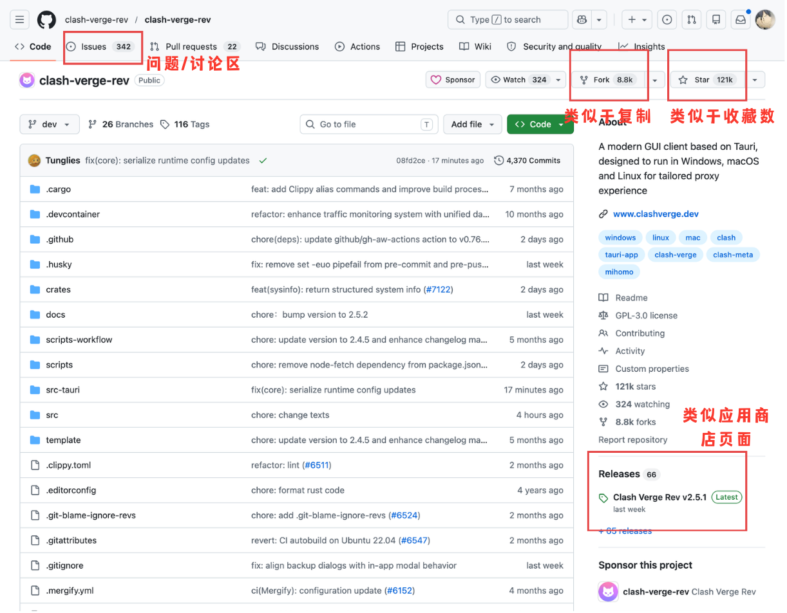

进入一个仓库，你会看到一堆文件，可能还有各种陌生的标签。别慌，先找这几个地方：

**1. README 文件**

几乎每个正经项目都有一个 `README.md` 文件，会自动显示在页面底部。这就是这个项目的"说明书"，写了这是什么、能干什么、怎么用。这是你首先应该读的地方。

**2. Stars 和 Forks 数量**

在仓库名称下方，你会看到 ⭐ Stars 和 🍴 Forks 的数量。Stars 越多越受欢迎；Forks 表示有多少人"复制"了这个项目去自己研究或改造。

**3. Issues（问题/讨论区）**

点上方的 `Issues` 标签，你能看到大家对这个项目提出的问题和反馈——有点像产品的用户讨论区。如果你用这个工具遇到了问题，也可以来这里搜搜看有没有人问过同样的问题。

**4. Releases（发布版本）**

这是普通用户最应该重点认识的区域，却也是最容易让人看懵的地方。

如果说 README 是项目的"说明书"，那 **Releases 就是项目的"应用商店页面"**——开发者在这里发布可以直接用的程序版本，不需要你懂任何代码。

点开 `Releases`，你会看到类似这样的信息：

- 版本号（比如 `v5.48.0`），标着 **Latest** 的就是当前最新稳定版
- 发布日期（比如 `on Mar 27`）
- 一段更新说明（changelog），写了这个版本修了什么、加了什么功能
- 下方的 **Assets（资产/附件）** 区域，列出了所有可以下载的文件

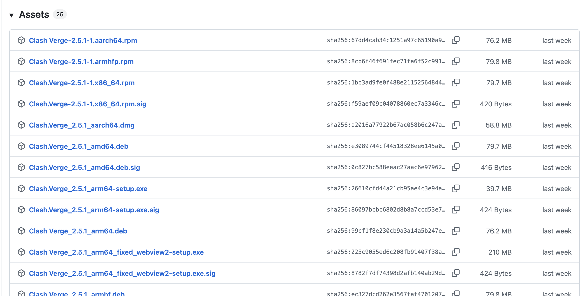

Assets 里那一堆文件名，才是真正让人摸不着头脑的地方。我来逐一拆解：

**🖥️ 按操作系统选文件**

首先，根据你的操作系统，找对应的文件：

| 文件名中包含 | 对应系统 |
|------------|--------|
| `windows` 或 `win` | Windows |
| `macos` 或 `darwin` 或 `mac` | macOS（苹果电脑） |
| `linux` | Linux |

**💻 还要区分芯片架构**

现在光知道系统还不够，还得看芯片。尤其是 Mac 用户：

| 文件名中包含 | 适用于 |
|------------|------|
| `x64` 或 `x86_64` 或 `amd64` | Intel 芯片的电脑（旧款 Mac、大多数 Windows 电脑） |
| `arm64` 或 `aarch64` 或 `apple-silicon` | ARM 芯片（苹果 M1/M2/M3 系列 Mac，部分新 Windows） |
| `x86` 或 `i686` | 32位系统（很老的电脑，现在很少见） |

> 💡 **不知道自己 Mac 是什么芯片？** 点左上角苹果图标 → "关于本机"，如果写的是 "Apple M1/M2/M3" 就选 `arm64`；如果写的是 "Intel" 就选 `x64`。
>
> **Windows 用户** 大概率选 `x64` 就对了，除非你的电脑买于2022年之后且特别注明是 ARM。

**📦 文件格式代表什么？**

选对了系统和芯片，还有一关：文件格式。

**桌面端：**

| 扩展名 | 说明 | 适合谁 |
|-------|------|--------|
| `.exe` | Windows 安装程序，双击直接安装 | Windows 用户首选 |
| `.msi` | Windows 安装包的另一种格式，同样双击安装 | Windows 用户 |
| `.zip` / `.7z` | 压缩包，解压后直接运行，不需要安装 | 想"绿色版"不写注册表的用户 |
| `.dmg` | macOS 专用安装镜像，双击打开拖到 Applications 文件夹 | Mac 用户首选 |
| `.pkg` | macOS 安装包，双击运行安装向导 | Mac 用户 |
| `.AppImage` | Linux 专用，单文件可执行，给权限直接运行 | Linux 用户 |
| `.deb` | Linux（Debian/Ubuntu 系）的安装包 | Ubuntu 用户 |
| `.rpm` | Linux（RedHat/Fedora 系）的安装包 | Fedora 用户 |
| `.tar.gz` / `.tar.xz` | Linux/Mac 的压缩源码包，通常需要编译 | 开发者，普通用户一般不需要 |


**📱 移动端：**

| 扩展名 | 说明 | 适合谁 |
|-------|------|--------|
| `.apk` | Android 安装包，相当于 Android 版的 `.exe` | Android 用户 |
| `.aab` | Android App Bundle，是给开发者上传到 Google Play 用的格式，**普通用户无法直接安装**，跳过 | 开发者专用 |
| `.ipa` | iOS 应用包，但**直接下载没有用**——苹果系统有严格限制，不能随意安装来路不明的 `.ipa`，正规渠道只能走 App Store | iOS 用户一般用不到 |

> ⚠️ **关于 Android APK 的安全提示**：从 GitHub 下载 APK 安装时，手机会弹出"未知来源应用"的警告，需要你手动允许。这不代表文件有问题——很多知名开源应用（比如 F-Droid 上的 App）都是这样分发的。但前提是你要确认这是**官方仓库**发布的版本，不要从来路不明的链接下载 APK。
>
> 文件名里同样会标注芯片架构：`arm64-v8a` 是现在绝大多数安卓手机用的架构，优先选这个；`armeabi-v7a` 是老款32位机型；`x86_64` 是极少数安卓模拟器或特殊设备。不确定就选 `arm64-v8a`，或者找有 `universal`（通用）字样的版本。

**还有两个固定出现的文件，不用管：**

- `Source code (zip)` 和 `Source code (tar.gz)` — 这是项目的**源代码压缩包**，不是可运行的程序。普通用户完全不需要下载这两个。

---

**用一个真实项目来练手：pot-desktop**

光看表格太抽象，我们来看一个真实项目的 Releases 页面。

[**pot-desktop**](https://github.com/pot-app/pot-desktop) 是一款非常流行的开源划词翻译 + OCR 工具（⭐ 17k+ Stars），由中文开发者维护，支持 Windows、Mac、Linux 全平台，它的 Releases 页面几乎涵盖了你在 GitHub 上会见到的所有文件格式，是练手的绝佳例子。

打开它的 [Releases 页面](https://github.com/pot-app/pot-desktop/releases)，展开最新版本的 Assets，你会看到密密麻麻将近 40 个文件，第一次看确实令人头皮发麻：

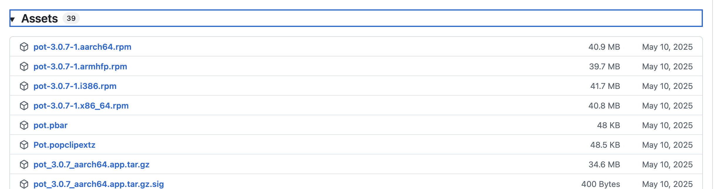

```
Assets (39)

pot-3.0.7-1.aarch64.rpm               ← Linux / Fedora 系 / ARM64 芯片
pot-3.0.7-1.armhfp.rpm                ← Linux / Fedora 系 / ARMv7（老款 ARM）
pot-3.0.7-1.i386.rpm                  ← Linux / Fedora 系 / 32位 x86
pot-3.0.7-1.x86_64.rpm               ← Linux / Fedora 系 / 64位（常见 PC）

pot_3.0.7_aarch64.deb                 ← Linux / Ubuntu 系 / ARM64 芯片
pot_3.0.7_aarch64_universal.deb       ← Linux / Ubuntu 系 / ARM64 / 兼容性更好的版本
pot_3.0.7_amd64.deb                   ← Linux / Ubuntu 系 / 64位（常见 PC）
pot_3.0.7_amd64_universal.deb         ← Linux / Ubuntu 系 / 64位 / 兼容性更好的版本
pot_3.0.7_armhf.deb                   ← Linux / Ubuntu 系 / ARMv7
pot_3.0.7_armhf_universal.deb         ← Linux / Ubuntu 系 / ARMv7 / 兼容性更好的版本
pot_3.0.7_i386.deb                    ← Linux / Ubuntu 系 / 32位
pot_3.0.7_i386_universal.deb          ← Linux / Ubuntu 系 / 32位 / 兼容性更好的版本

pot_3.0.7_amd64.AppImage              ← Linux / AppImage 单文件 / 64位

pot_3.0.7_aarch64.dmg                 ← macOS / M1/M2/M3（ARM）芯片
pot_3.0.7_aarch64.app.tar.gz          ← macOS / M1/M2/M3 / 压缩包形式（同上，二选一）
pot_3.0.7_aarch64.app.tar.gz.sig      ← 签名验证文件，不用下载
pot_3.0.7_x64.dmg                     ← macOS / Intel 芯片
pot_3.0.7_x64.app.tar.gz              ← macOS / Intel / 压缩包形式

pot_3.0.7_x64-setup.exe               ← Windows / Intel/AMD 64位 / 安装版 ✅ 大多数人选这个
pot_3.0.7_x64_fix_webview2_runtime-setup.exe  ← Windows / 64位 / 企业版系统专用（内置运行库）
pot_3.0.7_arm64-setup.exe             ← Windows / ARM 芯片
pot_3.0.7_arm64_fix_webview2_runtime-setup.exe ← Windows / ARM / 企业版专用
pot_3.0.7_x86-setup.exe              ← Windows / 32位旧电脑

pot.pbar                              ← pot 专用插件包，不是安装程序
Pot.popclipextz                       ← macOS PopClip 插件，非主程序

Source code (zip)                     ← 源代码，普通用户不需要
Source code (tar.gz)                  ← 源代码，普通用户不需要
```

看起来很多，但用**系统 + 芯片 + 格式**三步过滤后，绝大多数文件都可以直接略过：

**如果你是 Windows 用户（Intel/AMD 芯片，占大多数）：**
→ 下载 `pot_3.0.7_x64-setup.exe`，双击安装，完事。

**如果你是 Mac 用户（M1/M2/M3 芯片）：**
→ 下载 `pot_3.0.7_aarch64.dmg`，打开拖入 Applications。

**如果你是 Mac 用户（Intel 芯片）：**
→ 下载 `pot_3.0.7_x64.dmg`，同上。

**如果你是 Ubuntu 用户（普通 64位 PC）：**
→ 下载 `pot_3.0.7_amd64.deb`，安装；如果装不上再换 `_universal` 版本。

39 个文件，最终你只需要下载其中 **1 个**。其余的都是给其他系统、其他芯片、或者开发者准备的，完全不用管。

> 💡 **顺便一提**：pot-desktop 本身非常好用，选词即翻译、截图 OCR，支持几十种翻译引擎，感兴趣可以顺手装一个试试。

---

**🚨 下载完装不上？常见报错和解决方法**

这是很多人卡住的地方——文件下载好了，双击却弹出一个让人摸不着头脑的报错。别慌，这几乎是每个人第一次装开源软件都会遇到的"门槛"，原因很固定，解法也很固定。

**Mac 篇**

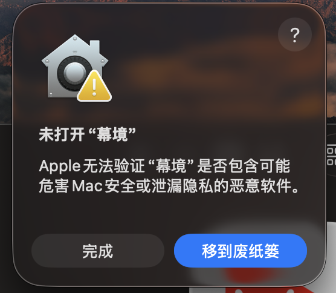

**问题一："无法打开，因为它来自身份不明的开发者"** 或 **"已损坏，无法打开"**

这是 macOS 的 Gatekeeper 安全机制在起作用。苹果要求开发者花钱进行"公证"认证，但很多开源项目的开发者不愿意或没有完成这个流程，所以系统会直接拦截。**文件本身没有问题。**

解决方法：

1. **方法一（推荐）**：打开「系统设置」→「隐私与安全性」，往下滚，你会看到一条提示说"已阻止使用 XXX，因为来自身份不明的开发者"，旁边有个**「仍要打开」**按钮，点它，再确认一次就行了。

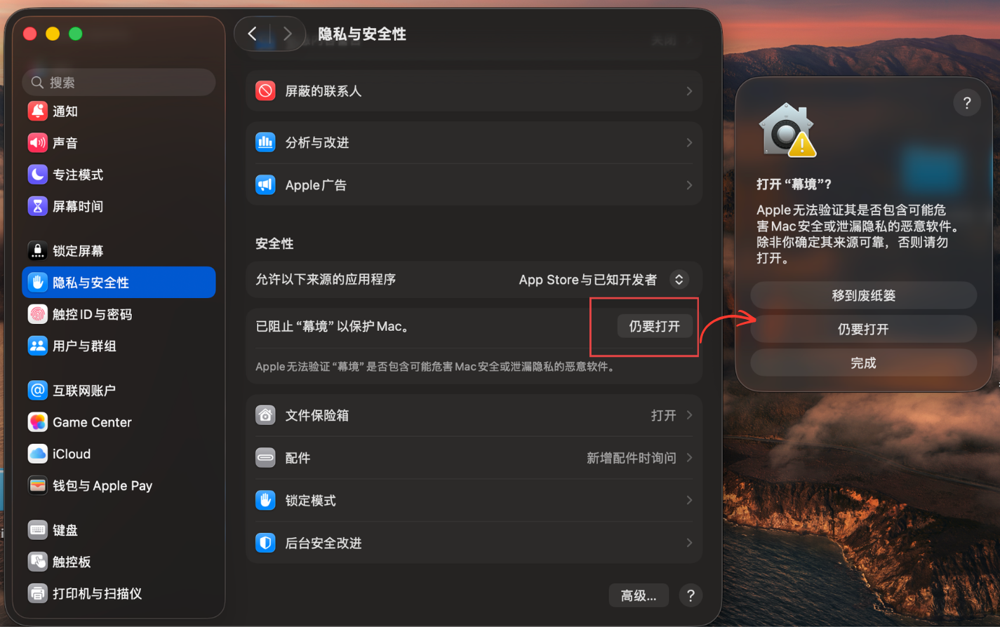

2. **方法二**：在 Finder 里找到这个 `.app` 文件，**按住 `Control` 键再单击**（或者右键），选「打开」，弹出的对话框里会多出一个「打开」按钮，点它即可。之后再双击就不会拦截了。

3. **方法三（如果以上都没用）**：打开「终端」（Terminal），输入以下命令，把路径换成你的 app 实际位置：
   ```
   xattr -cr /Applications/软件名.app
   ```
   回车执行，然后再尝试打开。

> ⚠️ 以上方法只适用于你**信任的来源**（比如 GitHub 官方仓库的 Releases）。对于来路不明的软件，系统的拦截是在保护你，不要随意绕过。

---

**问题二：`.dmg` 打开后拖进 Applications，软件却找不到或打不开**

常见原因有两个：

- **还没有真正"安装"完**：`.dmg` 打开后，你需要把里面的 `.app` 图标**拖动到旁边的 Applications 文件夹快捷方式上**，才算安装完成。只是打开了 `.dmg` 镜像，不等于安装好了。
- **直接从 `.dmg` 里运行了**：有些人会直接双击 `.dmg` 里的 app 来用，这样可能会有权限问题。正确做法是拖进 Applications 后，从启动台或 Applications 文件夹里打开。

---

**问题三：M1/M2/M3 Mac 下载了 `x64` 版本，运行很卡或有奇怪问题**

这是因为苹果芯片原生支持 `arm64`，运行 `x64` 程序需要通过 Rosetta 2 转译，虽然大多数时候没问题，但个别软件会有兼容性问题。解决方法就是回到 Releases 页面，重新下载带 `arm64` 或 `apple-silicon` 字样的版本。

---

**Windows 篇**

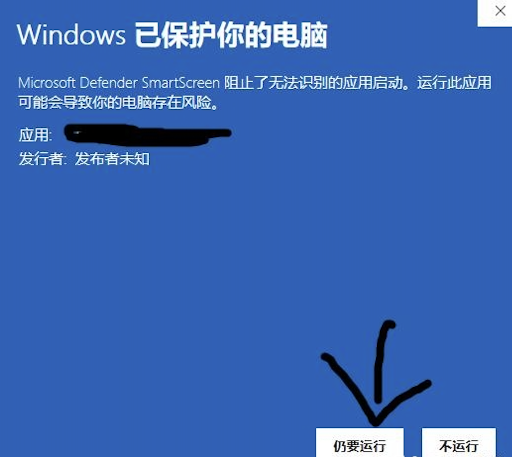

**问题一："Windows 已保护你的电脑"（SmartScreen 蓝色警告框）**

这是 Windows Defender SmartScreen 的拦截提示，原因和 Mac 一样——软件没有经过微软的数字签名认证。同样，**来自正规 GitHub 仓库的文件本身没有危险。**

解决方法：点击蓝色警告框左下角的**「更多信息」**，然后会出现一个**「仍要运行」**按钮，点它就能继续安装。

---

**问题二：安装时被杀毒软件（360、火绒、Windows Defender）直接删除或隔离**

开源软件有时会触发杀毒软件的误报，尤其是一些系统工具类软件（因为它们需要调用底层权限，行为特征和某些病毒相似）。

解决步骤：

1. 先去杀毒软件的**「隔离区」或「病毒库」**，找到被删的文件，选择**「恢复」**或**「信任」**
2. 把这个软件的安装目录**加入白名单/信任区**，防止下次再被删
3. 如果实在不放心，可以去 [VirusTotal](https://www.virustotal.com) 上传文件，它会用70多个杀毒引擎同时扫描，结果一目了然

---

**问题三：提示"缺少 DLL 文件"或"无法启动此程序"**

这通常是电脑缺少某个**运行库（Runtime）**。常见的有：

- **Visual C++ 运行库**：去微软官网搜索 "Visual C++ Redistributable" 下载安装，选最新版本，`x64` 和 `x86` 都装上
- **.NET Framework** 或 **.NET Runtime**：同样去微软官网下载对应版本，报错信息里通常会写需要哪个版本

安装完运行库，再重新打开软件，十有八九就好了。

---

**问题四：解压 `.zip` 后双击 `.exe`，一闪而过什么都没发生**

可能原因：

- **路径包含中文**：把软件文件夹移动到一个**全英文路径**的地方（比如 `C:\Tools\软件名`），再运行
- **需要以管理员身份运行**：右键 `.exe` → **「以管理员身份运行」**
- **解压不完整**：用 [7-Zip](https://www.7-zip.org/)（免费开源）重新解压，Windows 自带的解压偶尔会漏文件

---

### 场景四：给自己创建一个仓库

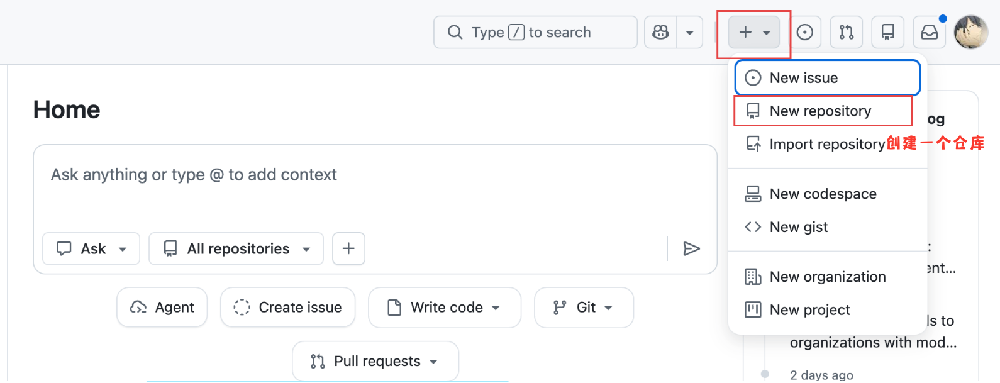

即使你不写代码，GitHub 也可以用来：

- **管理笔记**（用 Markdown 格式写，后面会解释）
- **备份重要文件**
- **写个人博客**（GitHub Pages 功能，免费！）
- **整理你的学习资源清单**

创建仓库很简单：

1. 登录后，点右上角 **`+`** 号 → **`New repository`**
2. 给仓库取个名字（比如 `my-notes` 或者 `reading-list`）
3. 选择 **Public（公开）** 还是 **Private（私密）**
4. 勾选 **`Add a README file`**（这样仓库不是空的）
5. 点 **`Create repository`**

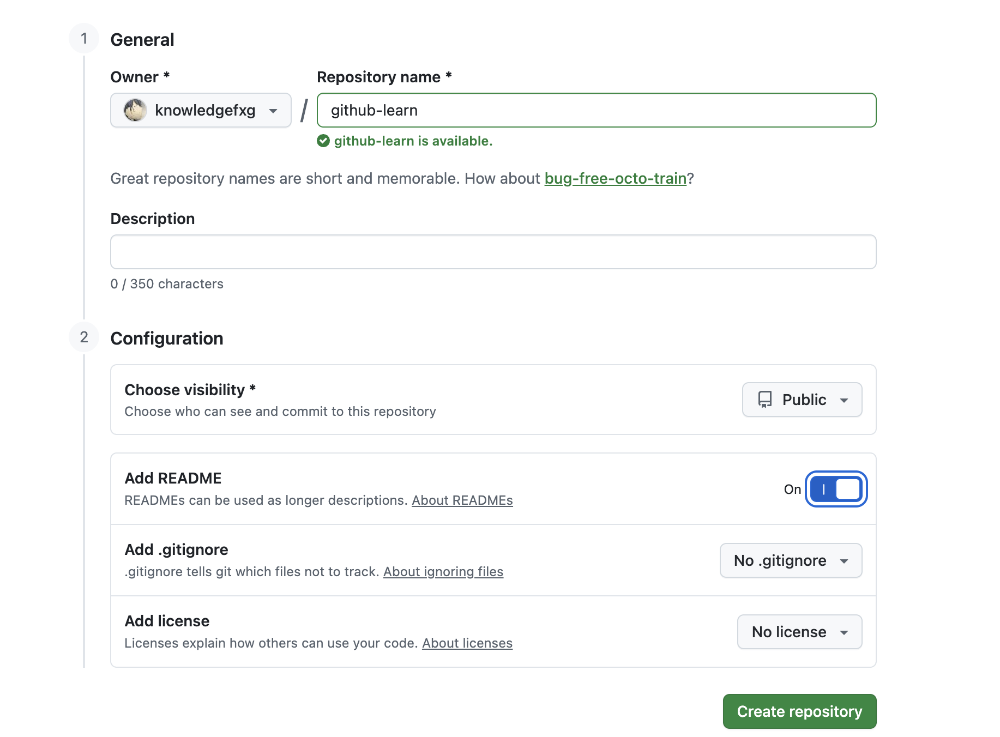

完成！你有自己的第一个 GitHub 仓库了。

---

## 四、Markdown：不会代码也能用的排版语言

GitHub 上大量的文字内容（README、Issue、笔记等）都用 **Markdown** 来写。

听起来很技术，其实超简单——它就是一套用**纯文字符号**来排版的规则：

```markdown
# 这是一级标题
## 这是二级标题

**这是加粗文字**
*这是斜体文字*

- 这是无序列表项
- 又一项

1. 这是有序列表
2. 第二条

> 这是引用块

[这是超链接](https://github.com)
```

写完之后，GitHub 会自动把它渲染成好看的格式。你不需要安装 Word，不需要调字体大小，**写什么符号，它就知道你要什么格式**。

花 10 分钟学一下 Markdown 的基本语法，你会发现它比 Word 好用多了——至少在写纯文字内容的时候。

---

## 五、README 里那些"看不懂的命令"是什么意思？

你有没有遇到过这种情况：某个 GitHub 项目看起来很厉害，README 里也有说明，但往下一翻，全是这样的东西——

```
npm install
npm run start
```

或者：

```
pip install -r requirements.txt
python app.py
```

然后你就不知道该怎么办了。

这一章就是专门来解释这些东西的。**不要跳过它——这是绝大多数人卡在 GitHub 门口最真实的原因。**

---

### 先理解一件事：有些软件需要"运行环境"

你平时用的软件（微信、浏览器、PS），安装完就能直接双击打开，因为它们是"打包好的成品"。

但 GitHub 上很多项目发布的是**源代码**，不是打包好的程序。这就好比你拿到了一份食谱，而不是一道做好的菜——你还需要有厨房、有食材、有锅，才能把它做出来。

这个"厨房"，就是所谓的**运行环境（Runtime）**。

不同语言写的项目，需要不同的运行环境。下面我来逐一介绍你最常见到的几种。

---

### 📝 VS Code：打开和编辑项目文件的标配工具

在正式介绍各种运行环境之前，有一个工具值得单独说——**Visual Studio Code**，简称 VS Code。

它是微软出品的免费代码编辑器，也是目前全球使用人数最多的编辑器没有之一。但它不只是"给程序员用的"，对于从 GitHub 下载项目、查看和编辑配置文件的普通用户来说，它同样是最顺手的工具。

**为什么推荐用 VS Code 打开 GitHub 项目？**

- 打开一个项目文件夹，左侧会展示完整的文件树，一目了然

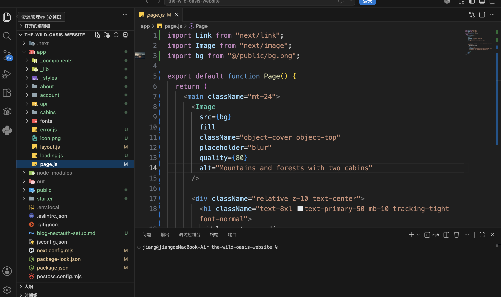

- 对 Markdown、JSON、YAML 等各种配置文件都有语法高亮，看起来清晰不费眼
- 内置终端，不需要单独开命令行窗口，直接在编辑器里输命令
- 有大量插件，包括中文界面包
- 完全免费，Windows / Mac / Linux 全支持

**怎么安装？**

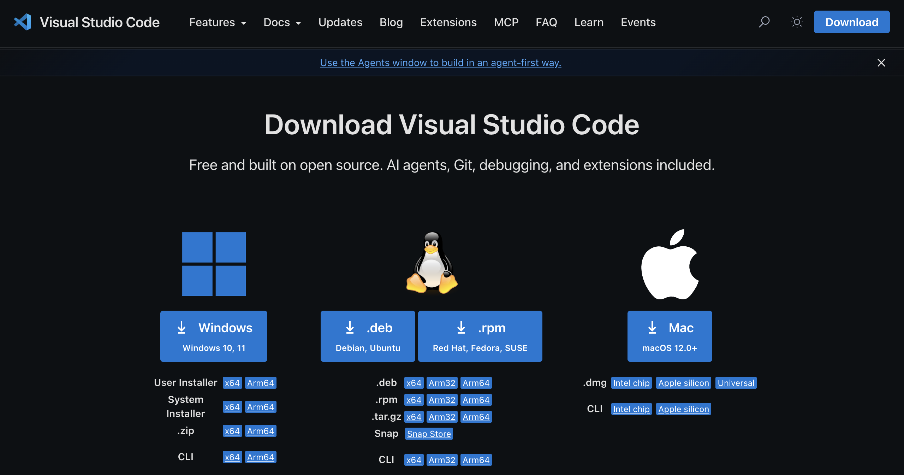

去 [code.visualstudio.com](https://code.visualstudio.com/) 下载，选对应系统安装即可。

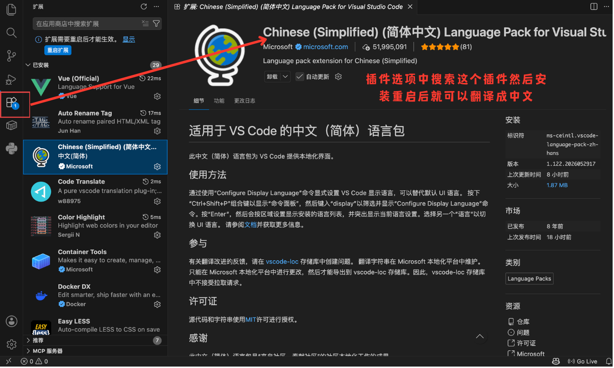

安装后，打开 VS Code，按 `Ctrl+Shift+X`（Mac 用 `Cmd+Shift+X`）打开插件市场，搜索 **Chinese** 安装中文语言包，重启后界面就变成中文了。

**怎么用它打开一个 GitHub 项目？**

把项目文件夹直接拖到 VS Code 图标上，或者在 VS Code 里选「文件」→「打开文件夹」，选中项目所在的文件夹即可。之后你会看到完整的项目结构，点击任意文件就能查看和编辑。

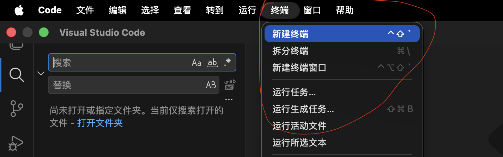

> 💡 **内置终端怎么打开？** 菜单栏选「终端」→「新建终端」，或者按 `` Ctrl+` ``（反引号）。打开后，终端的当前路径自动就在你的项目文件夹里，可以直接输入 `pip install` 或 `npm install` 这类命令，不需要手动 `cd`。

---

### 🐍 Python 和 pip

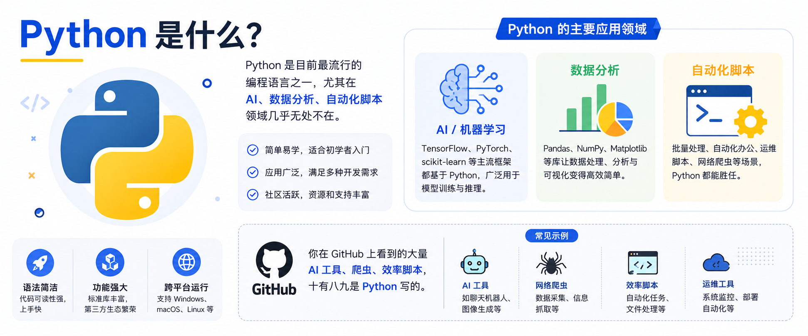

**Python 是什么？**

Python 是目前最流行的编程语言之一，尤其在 AI、数据分析、自动化脚本领域几乎无处不在。你在 GitHub 上看到的大量 AI 工具、爬虫、效率脚本，十有八九是 Python 写的。

**怎么安装 Python？**

去 [python.org](https://www.python.org/downloads/) 下载最新版，安装时**务必勾选 "Add Python to PATH"**（Windows 用户尤其注意，不勾这个后面会很麻烦）。

安装完后，打开终端（Windows 叫"命令提示符"或"PowerShell"，Mac 叫"终端"），输入：

```
python --version
```

如果输出了版本号（比如 `Python 3.12.0`），说明安装成功。

---

**pip 是什么？**

pip 是 Python 的**包管理器**——你可以把它理解成 Python 世界里的"应用商店"，专门用来安装别人写好的 Python 库（功能模块）。

它跟 Python 一起安装，不需要单独下载。

**常见的 pip 命令：**

```bash
# 安装某个库
pip install 库的名字

# 按照项目的依赖清单批量安装（最常用！）
pip install -r requirements.txt

# 查看已安装的库
pip list

# 升级某个库
pip install --upgrade 库的名字
```

你在 README 里看到 `pip install -r requirements.txt`，意思是：按照这个项目提供的 `requirements.txt` 文件，把所有需要的库都装上。这是运行一个 Python 项目的标准第一步。

> 💡 **Mac 用户注意**：系统自带的 Python 版本很老，建议从官网重新安装新版。安装后命令可能是 `python3` 和 `pip3` 而不是 `python` 和 `pip`，两者功能一样。

> ⚠️ **常见报错**：如果提示 `pip: command not found`，说明 Python 没有正确加入系统路径。Windows 用户重新运行安装程序，勾选"Add to PATH"；Mac 用户尝试用 `pip3` 替代 `pip`。

---

### 🟢 Node.js 和 npm

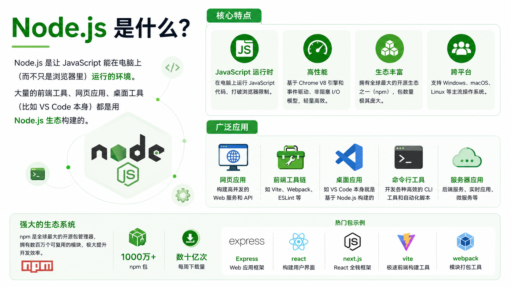

**Node.js 是什么？**

Node.js 是让 JavaScript 能在电脑上（而不只是浏览器里）运行的环境。大量的前端工具、网页应用、桌面工具（比如 VS Code 本身）都是用 Node.js 生态构建的。

**怎么安装 Node.js？**

去 [nodejs.org](https://nodejs.org/) 下载，选带 **LTS**（长期支持版）标签的那个，更稳定。

安装完后验证：

```
node --version
npm --version
```

两个都输出版本号就成功了。

---

**npm 是什么？**

npm（Node Package Manager）是 Node.js 的包管理器，地位相当于 Python 里的 pip。安装 Node.js 时会自动附带。

**常见的 npm 命令：**

```bash
# 安装项目所有依赖（进入项目文件夹后运行，最常用！）
npm install

# 启动项目
npm start
# 或者
npm run dev

# 安装某个具体的包
npm install 包的名字

# 全局安装某个工具
npm install -g 工具名
```

你在 README 里看到的 `npm install` + `npm run start`，标准流程就是：先装依赖，再启动程序。

---

**yarn 是什么？**

yarn 是 npm 的替代品，功能几乎相同，只是速度更快、命令略有不同。有些项目会推荐用 yarn 而不是 npm。

```bash
# 先全局安装 yarn
npm install -g yarn

# 然后用 yarn 安装依赖
yarn install
# 或简写
yarn

# 启动项目
yarn start
yarn dev
```

碰到 README 里写 `yarn` 命令的项目，照着用就行，和 npm 是同一个意思。

---

### ☕ Java 和相关工具

**Java 是什么？**

Java 是一门历史悠久、企业级应用非常广泛的编程语言。你在 GitHub 上偶尔会遇到需要 Java 环境的工具，尤其是一些安卓开发工具、数据处理工具或者老牌开源软件。

**怎么安装 Java？**

搜索 **JDK（Java Development Kit）** 下载，推荐去 [Adoptium](https://adoptium.net/) 下载免费的 OpenJDK，选 LTS 版本。

安装后验证：

```
java -version
```

**Maven 和 Gradle 是什么？**

它们是 Java 项目的构建工具，类似 Python 里的 pip。如果 README 里写了：

```
mvn install
mvn package
```

说明这个项目用的是 **Maven**（去 [maven.apache.org](https://maven.apache.org/) 下载）。

如果写的是：

```
./gradlew build
gradle run
```

说明用的是 **Gradle**（通常项目自带，不需要单独安装）。

对于普通用户来说，Java 生态相对复杂，如果一个工具有提供打包好的 `.jar` 文件或者 `.exe`，优先用那个，不要硬啃源码构建。

---

### 🦀 其他你可能遇到的

**Go（Golang）**

Go 是 Google 开发的语言，以编译速度快著称。用 Go 写的工具通常会在 Releases 里直接提供编译好的单文件可执行程序，**不需要安装 Go 本身**就能用——找对应系统的二进制文件下载就行。

如果真的需要从源码构建，去 [go.dev](https://go.dev/dl/) 下载 Go，然后：

```
go build
go run main.go
```

**Rust**

Rust 是近年来非常受欢迎的系统级语言。同样地，Releases 里一般有编译好的程序，直接下载即可。需要从源码构建时，先安装 Rust 工具链：

```
curl --proto '=https' --tlsv1.2 -sSf https://sh.rustup.rs | sh
```

然后：

```
cargo build --release
cargo run
```

**🐳 Docker（重点推荐）**

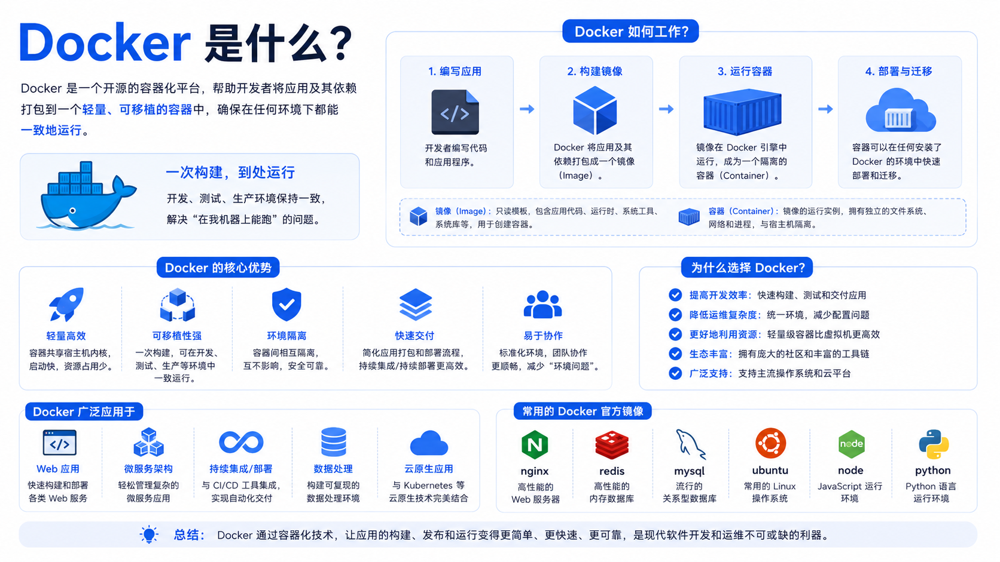

这是一个单独值得详细说说的东西，因为它对普通用户其实非常友好——尽管看起来很"技术"。

**Docker 是什么？用一个比喻说清楚**

你去朋友家，想用他电脑打开你自己做的一个工具，结果发现他电脑没装 Python，版本还不对，折腾了半小时都跑不起来……

Docker 解决的就是这个问题。

它把一个软件连同它所有需要的运行环境（Python、Node.js、数据库……），全部打包进一个叫**"镜像（Image）"**的东西里，就像一个**密封的集装箱**——不管你的电脑是 Windows 还是 Mac，装了什么、没装什么，只要有 Docker，这个集装箱打开就能用，完全不受外部环境影响。

你不需要自己配置任何依赖，一条命令搞定。

---

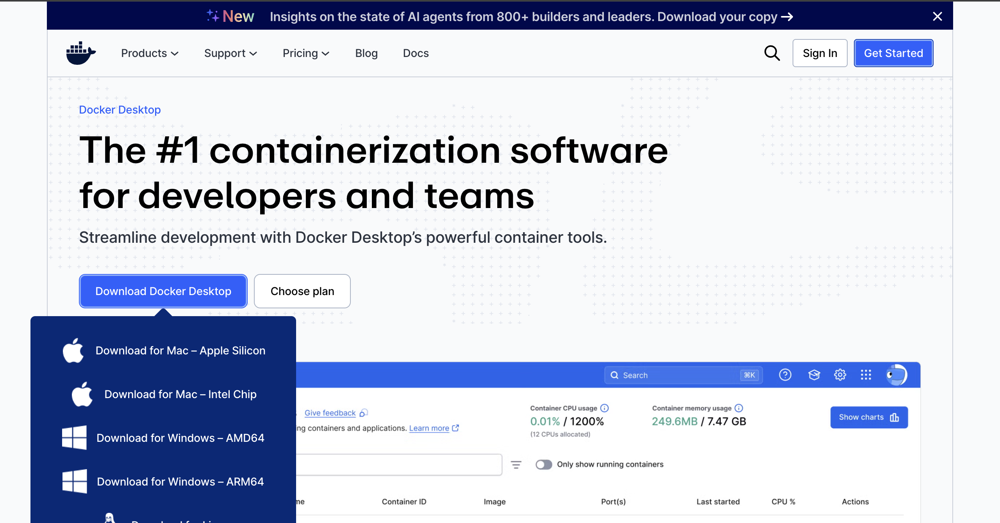

**安装 Docker Desktop**

去 [docker.com/products/docker-desktop](https://www.docker.com/products/docker-desktop/) 下载 **Docker Desktop**，有 Windows 和 Mac 版本，图形界面，安装完启动即可。

安装后验证：打开终端，输入：

```bash
docker --version
```

输出版本号就说明成功了。

> ⚠️ **Windows 用户注意**：Docker Desktop 在 Windows 上依赖 WSL 2（Windows Subsystem for Linux）。安装过程中如果提示需要开启或更新 WSL，按提示操作就行，安装程序会引导你完成。

---

**Docker 的几个核心概念，先搞懂再用**

| 概念 | 类比 | 说明 |
|-----|------|------|
| 镜像（Image） | 菜谱 / 模板 | 软件的"打包文件"，只读，不会变 |
| 容器（Container） | 按菜谱做出来的菜 | 镜像运行起来的实例，可以启动、停止、删除 |
| Docker Hub | 应用商店 | 存放公共镜像的仓库，大多数开源项目的镜像都发在这里 |
| `docker-compose` | 一键启动多个容器 | 当一个项目需要多个服务（比如网页+数据库）时用到 |

---

**常见的 Docker 命令详解**

你在 README 里最常看到的几种写法：

**① 直接运行一个镜像**

```bash
docker run -d -p 3000:3000 镜像名
```

拆解一下这条命令每个部分的意思：

- `docker run` — 拉取镜像（如果本地没有会自动下载）并启动一个容器
- `-d` — 后台运行（detached），不占用你的终端窗口
- `-p 3000:3000` — 端口映射，把容器内部的 3000 端口映射到你电脑的 3000 端口。运行后打开浏览器访问 `http://localhost:3000` 就能看到界面
- `镜像名` — 要运行的镜像，通常格式是 `用户名/项目名` 或者直接 `项目名`

**② 带数据持久化的运行**

```bash
docker run -d -p 3000:3000 -v /本地路径:/容器路径 镜像名
```

`-v` 是挂载本地文件夹到容器里。如果不加这个，容器删掉之后里面的数据也会消失；加上之后，数据保存在你本地，容器重建也不会丢。

**③ 带环境变量的运行**

```bash
docker run -d -p 3000:3000 -e API_KEY=你的密钥 镜像名
```

`-e` 是传入环境变量，很多项目需要你填入 API 密钥、数据库密码等配置。

---

**docker-compose：一键启动整套服务**

很多复杂项目不只有一个服务——比如一个 AI 工具可能同时需要启动"网页界面"+"模型服务"+"数据库"三个部分。这时候 README 里通常不会让你一条条敲 `docker run`，而是提供一个 `docker-compose.yml` 文件，然后让你执行：

```bash
# 启动所有服务（后台运行）
docker compose up -d

# 查看运行状态
docker compose ps

# 停止所有服务
docker compose down

# 停止并删除数据卷（彻底清空）
docker compose down -v
```

这一条 `docker compose up -d`，可以替代你手动配置 Python 环境、安装数据库、启动多个进程……对普通用户来说，这是目前**运行复杂开源项目最轻松的方式**没有之一。

---

**管理容器的常用命令**

装好 Docker 跑起来项目之后，你还需要知道怎么管理它：

```bash
# 查看正在运行的容器
docker ps

# 查看所有容器（包括已停止的）
docker ps -a

# 停止一个容器
docker stop 容器ID或容器名

# 启动一个已停止的容器
docker start 容器ID或容器名

# 删除一个容器
docker rm 容器ID或容器名

# 查看容器的实时日志（排查问题时很有用）
docker logs -f 容器ID或容器名

# 查看本地已下载的镜像列表
docker images

# 删除某个镜像（先删容器才能删镜像）
docker rmi 镜像名
```

> 💡 **容器 ID 不需要全部输入**，只要输入前几位能唯一区分就行，比如 `docker stop a3f` 通常就够了。

---

**一个完整的实际流程**

假设你在 GitHub 上找到一个带 Docker 支持的开源项目，README 的部署步骤一般长这样：

```bash
# 第一步：克隆项目
git clone https://github.com/某用户/某项目.git
cd 某项目

# 第二步：复制配置文件模板，填入你的设置（比如 API 密钥）
cp .env.example .env
# 用文本编辑器打开 .env 文件，修改里面的配置

# 第三步：一键启动
docker compose up -d

# 第四步：打开浏览器访问
# http://localhost:3000  （端口号以 README 说明为准）
```

整个过程不需要你安装 Python、Node.js 或任何其他运行环境，Docker 全部帮你搞定了。

---

**常见问题**

**Q：端口被占用，提示 `address already in use`**

说明你电脑上已经有别的程序在用这个端口了。可以把映射端口改一下，比如把 `-p 3000:3000` 改成 `-p 3001:3000`，然后访问 `http://localhost:3001`。

**Q：镜像下载太慢**

Docker Hub 在国内访问有时候很慢。可以在 Docker Desktop 的设置里配置镜像加速地址（国内有阿里云、腾讯云等提供的加速服务，搜索"Docker 镜像加速"找最新可用地址）。

**Q：`docker compose` 提示命令不存在**

老版本的 Docker 用的是 `docker-compose`（中间有横线），新版本改成了 `docker compose`（空格）。两种都试一下，哪个有效用哪个。

**Q：容器起来了但浏览器访问 localhost 没反应**

先用 `docker ps` 确认容器确实在运行，再检查端口号对不对。有时候项目的实际端口和 README 示例不一样，看一下 `docker-compose.yml` 文件里 `ports:` 那行写的是什么。

---

### 一张速查表：看到什么命令，需要装什么

| README 里看到 | 需要先安装 | 去哪下载 |
|-------------|---------|--------|
| `python`、`pip` | Python | python.org |
| `node`、`npm` | Node.js | nodejs.org |
| `yarn` | Node.js + yarn | nodejs.org，然后 `npm i -g yarn` |
| `java`、`mvn`、`gradle` | JDK | adoptium.net |
| `go build`、`go run` | Go | go.dev |
| `cargo build`、`cargo run` | Rust | rustup.rs |
| `docker run` | Docker Desktop | docker.com |
| `conda`、`mamba` | Anaconda / Miniconda | anaconda.com |

> 💡 **conda 补充说明**：如果 README 里写的是 `conda create` 或 `conda install`，说明这个项目推荐用 **Anaconda**（面向数据科学的 Python 发行版，自带大量常用库）。对于 AI 和机器学习项目，用 conda 管理环境比纯 pip 更不容易出问题。去 [anaconda.com](https://www.anaconda.com/) 下载 Miniconda（轻量版）即可。

---

### 关于"虚拟环境"——为什么 README 总让你先建一个

你可能还会在 README 里看到这样的步骤：

```bash
python -m venv venv
source venv/bin/activate    # Mac/Linux
venv\Scripts\activate       # Windows
pip install -r requirements.txt
```

这是在创建一个 **Python 虚拟环境（venv）**。

为什么要这么做？因为如果你同时在用多个 Python 项目，每个项目可能需要不同版本的同一个库，直接全装在系统里会互相冲突。虚拟环境就是给每个项目一个**独立的"小房间"**，库装在里面，互不干扰。

这不是可选步骤，**强烈建议照做**。激活虚拟环境后，命令行前面会出现 `(venv)` 字样，说明你已经进入了这个项目专属的环境。

---

## 八、几个常见误解，帮你扫清障碍

**❌ 误解一："GitHub 只能存代码"**

✅ 不对。GitHub 可以存任何文本文件，包括 Markdown 笔记、CSV 数据、配置文件、甚至小说草稿。当然，存图片、视频这类大文件就不太合适了（有大小限制）。

**❌ 误解二："我不懂命令行，就没法用 GitHub"**

✅ 不对。GitHub 的网页版已经支持绝大多数基础操作：创建文件、上传文件、编辑文件、提交修改……全程点击，不需要敲一行命令。

如果你以后想更高效地使用，可以下载 **GitHub Desktop**，这是 GitHub 官方出的图形界面客户端，依然不需要命令行。

**❌ 误解三："公开的仓库，别人会来改我的文件"**

✅ 不对。Public（公开）只意味着别人可以**看**，不意味着他们可以随意修改。只有你明确邀请的协作者，才有权限直接提交修改。别人如果想贡献，需要通过"Pull Request"的方式提交，你来决定接不接受。

**❌ 误解四："GitHub 是英文的，太难用了"**

✅ 界面确实是英文，但操作逻辑非常直观。而且现在 GitHub 已经有了一定程度的中文支持，加上浏览器翻译插件，基本不是障碍。

---

## 九、从今天开始，你可以做的三件事

不要只是读完就关掉——行动才会让知识变成能力。

**第一件事（5分钟）：** 注册一个 GitHub 账号，取一个你喜欢的用户名。

**第二件事（10分钟）：** 找一个你感兴趣的领域，在 GitHub 搜索关键词，给一个你觉得有意思的项目点一个 ⭐ Star——这相当于"收藏"，以后可以在你的个人主页找回来。

**第三件事（30分钟）：** 创建一个属于自己的仓库，把你最近在看的书单、或者想学的技能清单，用 Markdown 格式写下来，提交进去。

你不需要一开始就搞懂所有东西。GitHub 是一个你会随着使用越来越熟悉的工具——就像学骑自行车，真正上手才是开始。

---

## 总结

GitHub 不是程序员的专属领地，它是一个**任何人都可以参与的开放平台**。

- 你可以在上面**发现和下载**海量免费资源
- 你可以用它**管理自己的文件和笔记**
- 你可以用它**免费搭建个人网站**
- 你可以用它**了解和参与**你感兴趣的开源项目

最重要的一点：**GitHub 上绝大多数内容，都是人们自愿分享的。** 每一个你 Star 的项目背后，都有人花了大量时间无偿贡献。当你有一天也把自己的东西放上去的时候，你也成为了这个生态的一部分。

这感觉，挺好的。

---

## 延伸阅读

- [GitHub 官方文档（有中文）](https://docs.github.com/zh) — 最权威的参考资料
- [Markdown 语法速查表](https://www.markdownguide.org/cheat-sheet/) — 10分钟入门 Markdown
- [GitHub Desktop 下载](https://desktop.github.com/) — 图形界面客户端，无需命令行
- [GitHub Pages 官方指南](https://pages.github.com/) — 手把手教你建网站
- [sindresorhus/awesome](https://github.com/sindresorhus/awesome) — 各领域 awesome 清单的总目录，探索 GitHub 资源的起点
- 搜索关键词 `awesome` + 你感兴趣的任何话题，在 GitHub 里探索吧 🚀
